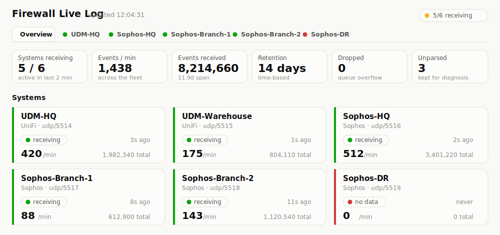
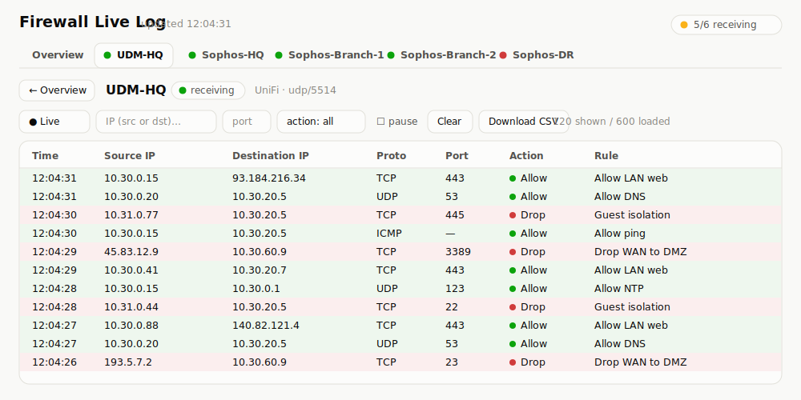

<p align="center"></p>

# firewall-live-log

A permanent, multi-device **live firewall log dashboard**. Each firewall
or gateway ships its syslog to its own UDP port; the dashboard shows a
real-time, colour-coded stream of every connection — source IP,
destination IP, protocol, port, and the allow/block verdict — across the
whole fleet at once, filterable by device, vendor, IP, and port.

Supports **UniFi** (UDM / UniFi OS, iptables-style logs) and **Sophos
Firewall** (SFOS v18–v22, key=value logs) simultaneously, with automatic
per-port vendor detection. Events are kept in SQLite with time-based
retention so you also get short-term history and CSV export.

- **Overview at a glance** — the landing page shows every configured
  system with a **receiving / quiet / stale / no-data** status, current
  rate, and last-seen time, so you can tell instantly whether a firewall
  has stopped sending. Each system also gets its own tab (with a status
  dot) in the tab bar.
- **Per-system live log** — click a system to open its own live stream:
  source IP, destination IP, protocol, port, allow/block verdict, and
  rule. **Green = allowed, red = blocked/dropped/rejected, blue =
  NAT/port-forward** (a translation record, not a permit/deny verdict).
- **Zero dependencies** — pure Python 3 standard library, one container.
- **One UDP port per device**, each labelled with a friendly name and
  vendor in a small JSON config.
- **Auto-detects UniFi vs Sophos** from the log format; override per port.
- **Filter** each system's log by source/destination IP (substring) and
  port — live or over a historical window.
- **Retention** (default 14 days) with an optional row-count safety cap;
  old events are pruned automatically and space reclaimed.
- **CSV export** of any filtered window, per system.

> For turning captured traffic into *firewall rules* (zone-pair analysis,
> rule candidates, port-range consolidation), see the companion project
> [unifi-syslog-analyzer](https://github.com/g-guglielmi/unifi-syslog-analyzer).
> This project is the always-on live view; that one is the batch
> rule-mining tool.

## Screenshots

**Overview** — fleet health at a glance: every system with its status,
current rate, and last-seen; one tab per system.



**Per-system live log** — click a system for its own colour-coded stream
(green = allowed, red = blocked), filterable by IP, port, and action.



<sub>Previews rendered with sample data.</sub>

## Quick start

```sh
# 1. Create a data directory on the host (bind mount) and a device config.
sudo mkdir -p /srv/firewall-live-log
sudo cp devices.example.json /srv/firewall-live-log/devices.json
sudo chown -R 10001:10001 /srv/firewall-live-log   # container runs as uid 10001

# 2. Run. --network host is recommended for a syslog collector: it needs
#    many UDP ports and preserves each packet's real source IP.
docker run -d --name firewall-live-log --restart unless-stopped \
  --network host \
  -v /srv/firewall-live-log:/data \
  ghcr.io/g-guglielmi/firewall-live-log:latest
```

Open the dashboard at `http://<docker-host>:8080` — the Overview lists
every configured system and turns green as logs arrive. Point each
firewall's syslog at this host on the port you assigned it, then click a
system to watch its live log.

The dashboard requires a login. On first start it creates an `admin`
account and prints a generated password to the logs
(`docker logs firewall-live-log`); log in and change it, or set your own
with `-e ADMIN_PASSWORD=…` on the `docker run`. See
[Authentication](#authentication) for details.

Pin a version for reproducible deploys:
`ghcr.io/g-guglielmi/firewall-live-log:v0.0.1`
(all versions under [Packages](https://github.com/g-guglielmi/firewall-live-log/pkgs/container/firewall-live-log)).

**Unraid / Portainer / other Docker UIs**: when adding the container
manually, paste this into the "Icon URL" field:

```
https://raw.githubusercontent.com/g-guglielmi/firewall-live-log/main/docs/icon.png?v=2
```

(An SVG version is also at `docs/icon.svg` if your UI prefers vector icons.)

> **Icon not updating after a change?** Unraid downloads the icon once and
> caches it, so it keeps showing the old one even after the file changes at
> the same URL. Bump the `?v=` number (e.g. `?v=3`) so Unraid sees a new URL
> and re-fetches. In a browser, hard-refresh (Ctrl+Shift+R) to clear the
> cached image.

### Without host networking

If you can't use `--network host`, publish the ports explicitly. A
contiguous range is easiest — assign your devices ports in that range in
`devices.json`:

```sh
docker run -d --name firewall-live-log --restart unless-stopped \
  -p 8080:8080 -p 5514-5539:5514-5539/udp \
  -v /srv/firewall-live-log:/data \
  ghcr.io/g-guglielmi/firewall-live-log:latest
```

Note: Docker's UDP port-forwarding can rewrite the packet source IP in
some configurations. Since the source IP is exactly what a firewall log
is about, `--network host` is the safer choice for this collector.

### Unraid template

A ready-made Docker template is in
[`unraid/firewall-live-log.xml`](unraid/firewall-live-log.xml). To
install it:

```sh
# From the Unraid terminal:
mkdir -p /boot/config/plugins/dockerMan/templates-user
curl -fL -o /boot/config/plugins/dockerMan/templates-user/my-firewall-live-log.xml \
  https://raw.githubusercontent.com/g-guglielmi/firewall-live-log/main/unraid/firewall-live-log.xml
```

Then go to **Docker → Add Container** and pick *firewall-live-log* from
the **Template** dropdown. Before the first start, put a `devices.json`
in the data folder (copy [`devices.example.json`](devices.example.json))
and make the folder writable by the container user:

```sh
chown -R 10001:10001 /mnt/user/appdata/firewall-live-log
```

If you run the container on a custom network (`br0` / a VLAN bridge)
instead of `bridge`, the port mappings are ignored — the container gets
its own IP and every port is reachable on it directly. Remember that
Unraid blocks host ↔ container traffic on macvlan networks unless
**Settings → Docker → Host access to custom networks** is enabled, and
that clients (and your firewalls' syslog senders) on other subnets need
a route and firewall permission to reach that VLAN.

## Device configuration (`devices.json`)

```json
{
  "retention_days": 14,
  "max_events": 0,
  "devices": [
    { "name": "UDM-HQ",          "port": 5514, "vendor": "unifi" },
    { "name": "Sophos-HQ",       "port": 5516, "vendor": "sophos" },
    { "name": "Unknown-Device",  "port": 5518, "vendor": "auto" }
  ]
}
```

- **name** — friendly label shown on the dashboard (must be unique).
- **port** — the UDP port this device sends syslog to (unique per device).
- **vendor** — `unifi`, `sophos`, or `auto` (detect from the log format).
- **retention_days** — how long events are kept (env `RETENTION_DAYS`
  overrides).
- **max_events** — optional hard cap on stored rows, `0` = disabled (env
  `MAX_EVENTS` overrides). A backstop against disk runaway on very busy
  fleets — see sizing below.

Editing `devices.json` takes effect on container restart.

## Configure the firewalls to send syslog

- **UniFi (UDM / UniFi OS):** Settings → CyberSecure → Traffic Logging →
  Flow Logging = *All Traffic* → Activity Logging (Syslog) → *SIEM
  Server* → this host, on that device's port.
- **Sophos Firewall (SFOS):** Configure → System services → Log settings
  → add a Syslog server (this host + the device's port, UDP) and enable
  *Firewall* traffic under the log selection.

## Environment variables

| Variable | Default | Purpose |
|---|---|---|
| `DEVICES_CONFIG` | `/data/devices.json` | Path to the device config. |
| `DB_PATH` | `/data/events.db` | SQLite file (on the bind mount). |
| `HTTP_PORT` / `HTTP_BIND` | `8080` / `0.0.0.0` | Dashboard/API. |
| `RETENTION_DAYS` | `14` | Overrides the config value. |
| `MAX_EVENTS` | `0` | Row-count cap (0 = off); overrides config. |
| `PRUNE_INTERVAL_SEC` | `3600` | How often retention is enforced. |
| `QUEUE_MAX` | `100000` | In-flight events before overflow drops. |
| `AUTH_ENABLED` | `true` | Require login. Set `false` **only** behind an authenticating reverse proxy. |
| `AUTH_DB_PATH` | `/data/auth.db` | SQLite file for users and sessions. |
| `ADMIN_USERNAME` | `admin` | Username of the bootstrap admin (first start only). |
| `ADMIN_PASSWORD` | _(generated)_ | Password for the bootstrap admin (also the new password when `ADMIN_RESET=true`). If unset, a random one is printed to the logs once and must be changed at first login. |
| `ADMIN_RESET` | `false` | On start, reset the `ADMIN_USERNAME` account's password (and clear its lockout) even if users exist — for recovering a forgotten admin password. Unset it again afterwards. |
| `ADMIN_EMAIL` | _(none)_ | Optional email for the bootstrap admin, so the admin can self-reset too. |
| `AUTH_FORCE_SECURE_COOKIE` | `false` | Force the `Secure` flag on the session cookie (otherwise auto-set when `X-Forwarded-Proto: https` is seen). |
| `PUBLIC_URL` | _(none)_ | Public base URL of the dashboard (e.g. `https://firewall.example.com`); used to build password-reset links. A bare hostname is assumed `https://`. Required for self-service reset emails. |
| `SMTP_HOST` | _(none)_ | SMTP server hostname. Setting it enables outbound email. |
| `SMTP_PORT` | `587` | SMTP port (`587` for STARTTLS, `465` for SSL). |
| `SMTP_USERNAME` / `SMTP_PASSWORD` | _(none)_ | SMTP auth credentials (omit for an unauthenticated relay). |
| `SMTP_FROM` | _(none)_ | Envelope/`From` address for sent mail. Required to send. |
| `SMTP_FROM_NAME` | _(none)_ | Optional display name for the `From` header. |
| `SMTP_SECURITY` | `starttls` | `starttls`, `ssl`, or `none`. |
| `MAIL_DEBUG_DIR` | _(none)_ | Dev/testing only: write emails to this directory instead of sending them. |

## Sizing & retention

A live log stores **one row per event** (a timeline can't be aggregated
the way rule-mining data can). Plan disk accordingly:

- Each stored event is roughly **0.2 KB** including indexes.
- At an average of *E* events/sec across the fleet, 14 days ≈
  `E × 86400 × 14 × 0.2 KB`. Example: 200 events/sec ≈ **~48 GB**.

If your fleet is busy, either shorten `RETENTION_DAYS`, set a `MAX_EVENTS`
cap, or scope firewall logging to the rule hits you actually want to see
rather than literally all traffic. The dashboard's **Dropped** tile shows
whether the writer is ever falling behind (queue overflow); **Unparsed**
shows lines that didn't match a parser.

## API

| Endpoint | Description |
|---|---|
| `GET /api/live?since=<cursor>&…` | Incremental tail; pass filters `device`, `vendor`, `ip`, `port`, `action`. |
| `GET /api/events?window=<secs>&…` | Historical snapshot within a time window. |
| `GET /api/events.csv?window=<secs>&…` | CSV of a filtered window. |
| `GET /api/stats` | Totals, rate, per-device activity, retention. |
| `GET /api/devices` | Configured devices. |

`action` filter accepts `Allow`, `blocked` (Block/Drop/Reject), or `NAT`
(DNAT/SNAT/masquerade/port-forward translation records).
`ip` matches as a substring of source or destination; `port` matches as
a prefix (`44` finds 443 and 445) — prefix it with `=` for an exact
match (`=80` excludes 8080).

## Testing

```sh
docker run --rm ghcr.io/g-guglielmi/firewall-live-log:latest python3 /app/test_harness.py
```

Boots the real app, feeds synthetic UniFi and Sophos syslog to separate
ports, and verifies parsing, action normalization, auto-detection,
filters, retention pruning, CSV export, and a graceful-stop final flush.
The same harness gates CI and every release. It also runs directly with
`python3 test_harness.py` on Linux/macOS/Windows.

## Authentication

The dashboard requires a login. Accounts live in a dedicated SQLite file
(`auth.db`, next to `events.db` on the data mount); passwords are stored
only as salted **PBKDF2-HMAC-SHA256** hashes (600k iterations), never in
clear text. Everything here is still pure Python standard library — no new
dependencies.

### First start — the default admin

On its first start with an empty user database, the app creates one
**admin** account:

- If you set `ADMIN_PASSWORD` (and optionally `ADMIN_USERNAME`, default
  `admin`), the admin is created with that password.
- If you don't, a strong random password is generated, printed **once** to
  the container logs, and the admin must change it at first login:

  ```
  [auth] ============================================================
  [auth] created default admin user 'admin' with a generated password:
  [auth]     Xy7…redacted…aQ
  [auth] Log in and change it now — it will not be shown again.
  [auth] ============================================================
  ```

  Read it with `docker logs firewall-live-log`.

Once logged in, the admin can create more accounts from the **Users** panel
(top-right of the dashboard). There are two roles:

- **admin** — view everything *and* manage users.
- **user** — view the dashboard only.

A user's role is set when you create it and can be changed later from the
per-row **role dropdown** in the Users panel (promote to admin / demote to
user). You can't change your own role, and the last remaining admin can't be
demoted or deleted, so there's always at least one admin and you can't lock
yourself out.

Each account can have an **email** attached (set it when creating the user,
per-row in the Users panel, or via the **Set email** item in the account
menu for your own account). An email is what enables self-service password
reset, below.

Passwords must be at least 12 characters.

### Self-service password reset (email)

Users can reset their own password from the **Forgot your password?** link
on the sign-in page — no admin needed — once two things are configured:

1. An **SMTP server** (so the app can send mail), and
2. **`PUBLIC_URL`** — the address users reach the dashboard at, used to
   build the link in the email. The app builds the link from this variable
   (not the request's `Host` header), so a spoofed host can't turn a reset
   email into a malicious link.

```sh
docker run -d --name firewall-live-log --restart unless-stopped \
  --network host -v /srv/firewall-live-log:/data \
  -e PUBLIC_URL='https://firewall.example.com' \
  -e SMTP_HOST='smtp.example.com' -e SMTP_PORT=587 \
  -e SMTP_USERNAME='firewall-live-log@example.com' \
  -e SMTP_PASSWORD='…' -e SMTP_FROM='firewall-live-log@example.com' \
  ghcr.io/g-guglielmi/firewall-live-log:latest
```

The flow: the user enters their username or email → they always see the same
"if an account exists, a link has been sent" response (so it can't be used
to discover who has an account) → if the account exists and has an email, a
one-time link valid for **30 minutes** is emailed. Opening it lets them set
a new password, which revokes their existing sessions and clears any
lockout. Reset requests are rate-limited per account and per source IP, and
reset tokens are single-use and stored only as hashes.

If SMTP or `PUBLIC_URL` isn't configured, the link simply does nothing (the
page still shows the same generic message) and admins can always reset a
user from the Users panel instead.

### Forgot the admin password?

If you're locked out and have no other admin, recover in place with
`ADMIN_RESET`. Set `ADMIN_RESET=true` **and** `ADMIN_PASSWORD` to a new
password, then restart the container:

```sh
docker run -d --name firewall-live-log --restart unless-stopped \
  --network host -v /srv/firewall-live-log:/data \
  -e ADMIN_RESET=true -e ADMIN_PASSWORD='my-new-strong-password' \
  ghcr.io/g-guglielmi/firewall-live-log:latest
# (or edit these two variables on the existing container and restart)
```

On start this resets the `ADMIN_USERNAME` account (default `admin`): it
sets the new password, ensures the account is an admin, clears any
brute-force lockout, and revokes its old sessions — **without touching any
other user or your event history**. If you leave `ADMIN_PASSWORD` blank, a
random password is generated and printed to the logs instead.

**Then remove `ADMIN_RESET`** (set it back to `false` or delete the
variable) and restart — otherwise the admin password is reset on every
start. As a last resort you can still delete `auth.db` from the data mount
to wipe all accounts and start over.

### How sign-in is protected

- **Sessions** are random tokens set as an `HttpOnly`, `SameSite=Strict`
  cookie; only a hash of the token is stored server-side, and sessions
  expire after 12 hours. The cookie gets the `Secure` flag automatically
  when the app sees `X-Forwarded-Proto: https` (i.e. behind a
  TLS-terminating proxy); force it with `AUTH_FORCE_SECURE_COOKIE=true`.
- **Brute-force lockout** — after **5 failed logins for a username within
  15 minutes**, that username is locked until the window passes; the login
  API returns `429` with a `Retry-After`. A more lenient per-IP backstop
  catches username-spraying, and unknown usernames still run a full
  password hash so response timing never reveals whether a user exists.
- **CSRF** — every state-changing request must also carry a session-bound
  token in the `X-CSRF-Token` header.
- All SQL is parameterised, all dynamic output is HTML-escaped, static
  files are served by fixed name only, and every response carries
  `Content-Security-Policy` (with a per-response script nonce),
  `X-Content-Type-Options: nosniff`, `X-Frame-Options: DENY`, and
  `Referrer-Policy: no-referrer`.

For internet-facing deployments, still terminate TLS at a reverse proxy in
front of the container — the app itself speaks plain HTTP.

### Already have an auth proxy?

If access is already enforced by an authenticating reverse proxy and you
don't want the built-in login, set `AUTH_ENABLED=false`. **Only do this
when something else gates access** — with it off, the dashboard and API are
completely open.

## Security notes

- Firewall logs are sensitive metadata about your network; protect the
  bind-mounted data directory accordingly.
- The container runs as a non-root user (uid 10001); the bind-mounted
  data directory must be writable by that uid (`chown 10001`), and
  `devices.json` must be readable by it.
- That non-root user cannot bind UDP ports below 1024. Assign collection
  ports ≥ 1024 in `devices.json` (the examples use 5514+). If a firewall
  can only send to 514, remap it on the host (e.g. a `PREROUTING` DNAT to
  a high port) rather than running the container as root.

## License

[MIT](LICENSE)
